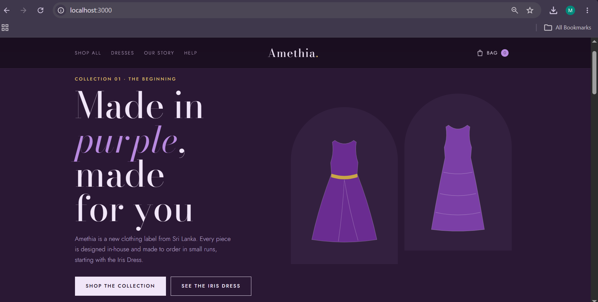
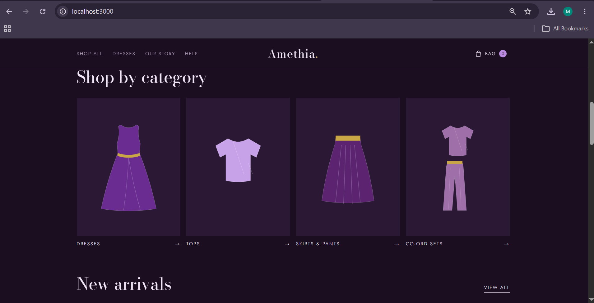
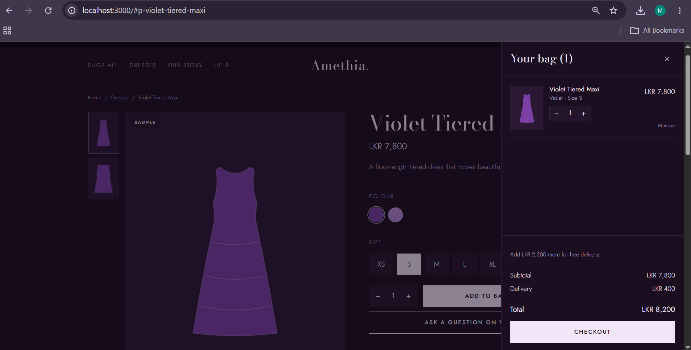
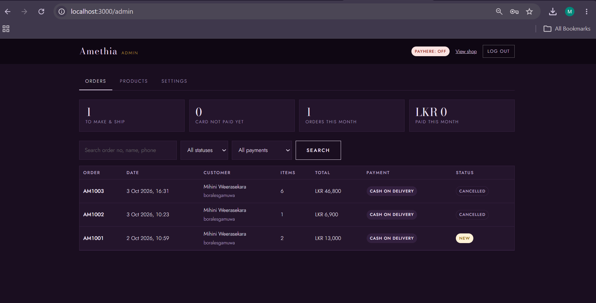

<div align="center">

# 💜 Amethia

### An online clothing store for a new Sri Lankan fashion brand

A full-stack e-commerce web app with a storefront, card payments through PayHere, and an admin panel, built with plain JavaScript and Node.js.


</div>

---

## 📖 About the Project

**Amethia** is a real client project: an online shop for a young designer launching her own clothing brand. The goal was to give her a place to showcase her first design, take orders and accept card payments, and add new pieces easily as the brand grows.

The whole app runs on **Node.js with zero npm dependencies**. It uses Node's built-in SQLite for the database, so there is nothing to install apart from Node itself.

---

## ✨ Features

### 🛍️ Storefront (customers)
- Home page, shop page and individual product pages
- Shopping bag and checkout
- Order tracking page
- "Our Story" and Help/FAQ pages
- Size chart, delivery and exchange information
- Fully responsive design in the brand's purple theme

### 💳 Payments
- Card payments through **PayHere** (Visa, Mastercard, Amex and mobile wallets)
- Optional **cash on delivery**
- Card details never touch the website; customers pay on PayHere's secure page
- Server verifies every PayHere notification (signature + amount) before marking an order **Paid**

### 🔐 Admin Panel (`/admin`)
- **Orders:** search, view details and move orders through *New → Being made → Shipped → Delivered*
- **Products:** add/edit items, prices, colours, sizes and descriptions; upload photos; hide items or mark them sold out
- **Settings:** WhatsApp number, social links, email, delivery fee, free-delivery threshold and COD on/off
- Shows whether PayHere is in **test** or **live** mode

---

## 📸 Screenshots

| Home Page | Product Page |
|:---:|:---:|
|  |  |

| Shopping Bag | Admin Panel |
|:---:|:---:|
|  |  |

---

## 🛠️ Tech Stack

| Layer | Technology |
|---|---|
| **Frontend** | HTML5, CSS3, Vanilla JavaScript |
| **Backend** | Node.js 22+ (built-in `http` server, no frameworks) |
| **Database** | SQLite (Node's built-in `node:sqlite`) |
| **Payments** | PayHere payment gateway (sandbox + live) |
| **Config** | `.env` file for secrets and settings |

---

## 📁 Project Structure

```
amethia/
├── server.js          # Backend: website, API, PayHere, admin login
├── lib/
│   ├── config.js      # Reads settings from .env
│   ├── db.js          # Database tables + starter products
│   └── payhere.js     # PayHere hash and payment verification
├── public/
│   ├── index.html     # Storefront page
│   ├── shop.js        # Storefront logic
│   ├── shop.css       # Design (colours, fonts, layout)
│   ├── garments.js    # Placeholder drawings until real photos are added
│   ├── admin.html     # Admin panel page
│   └── admin.js       # Admin panel logic
├── data/shop.db       # Database (created automatically on first start)
├── .env.example       # Example settings
└── package.json
```

---

## 🚀 Getting Started

### Prerequisites
- [Node.js](https://nodejs.org) **22.13 or newer**

### Installation

```bash
# 1. Clone the repository
git clone https://github.com/Mihiniii/amethia.git
cd amethia

# 2. Create your settings file
cp .env.example .env        # Windows: copy .env.example .env

# 3. Open .env and set ADMIN_PASSWORD and SESSION_SECRET

# 4. Start the server
npm start
```

Then open:
- 🛍️ Shop: **http://localhost:3000**
- 🔐 Admin: **http://localhost:3000/admin**

> No `npm install` needed: the project has no dependencies.

### PayHere (optional, for testing payments)
1. Create a free sandbox account at [sandbox.payhere.lk](https://sandbox.payhere.lk)
2. Add your test domain and copy the **Merchant ID** and **Merchant Secret**
3. Add them to `.env` with `PAYHERE_SANDBOX=true`
4. Use PayHere's test card numbers; no real money is charged

---

## 🔄 How a Card Payment Works

```
Customer checks out
        │
        ▼
Order saved as "Awaiting payment"
        │
        ▼
Customer pays on PayHere's secure page
        │
        ▼
PayHere notifies /api/payhere/notify
        │
        ▼
Server verifies signature + amount ──► Order marked "Paid" ✅
```

---

## 🔒 Security

- Prices are always **recalculated on the server**, so customers can't change prices in the browser
- Every PayHere notification is verified with the Merchant Secret and the amount must match the order
- Admin login **locks for 15 minutes** after 5 wrong passwords
- Secrets live only in `.env`, which is git-ignored and never committed

---

## 🗺️ Future Improvements

- [ ] Customer accounts and order history
- [ ] Email order confirmations
- [ ] Product search and filters
- [ ] Discount codes
- [ ] Sales dashboard with charts in the admin panel

---

## 👩‍💻 Author

**Mihini Weerasekara**
Final-year Computer Science undergraduate, Uva Wellassa University of Sri Lanka

[](https://github.com/Mihiniii)
[](https://linkedin.com/in/your-profile)

---

<div align="center">
⭐ If you like this project, give it a star!
</div>
